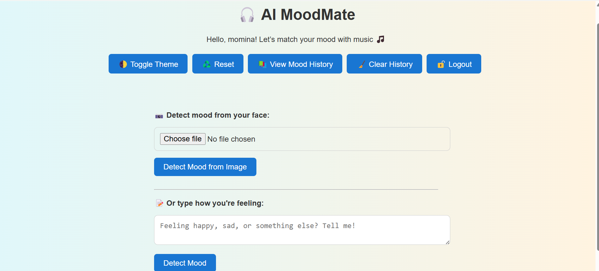

# 🎧 AI MoodMate

AI MoodMate is an intelligent mood-based music recommender web app.

🧠 Detect your mood from:
- Text (using TextBlob NLP)
- Image (using DeepFace face analysis)

🎵 Based on your mood, it suggests a matching song playlist.

---

## 🔥 Features

- 🎤 Text mood detection
- 📸 Image mood detection (via camera or upload)
- 🎨 Dark/Light mode toggle
- 🧠 Local storage mood history
- 🔐 Login system (browser-side)
- 💾 Playlist based on Pop, Rock, Lo-fi etc.

---

## 📁 Technologies Used

- Frontend: HTML, CSS, JavaScript
- Backend: Python Flask
- AI: TextBlob, DeepFace
- Storage: localStorage

---

## 📸 Screenshot

## 🚀 Live Demo
👉 [Click here to try AI MoodMate](https://mominasaqlain.github.io/AI_MoodMate/)

---

> 💻 Made with ❤️ by Momina Saqlain as an internship project

